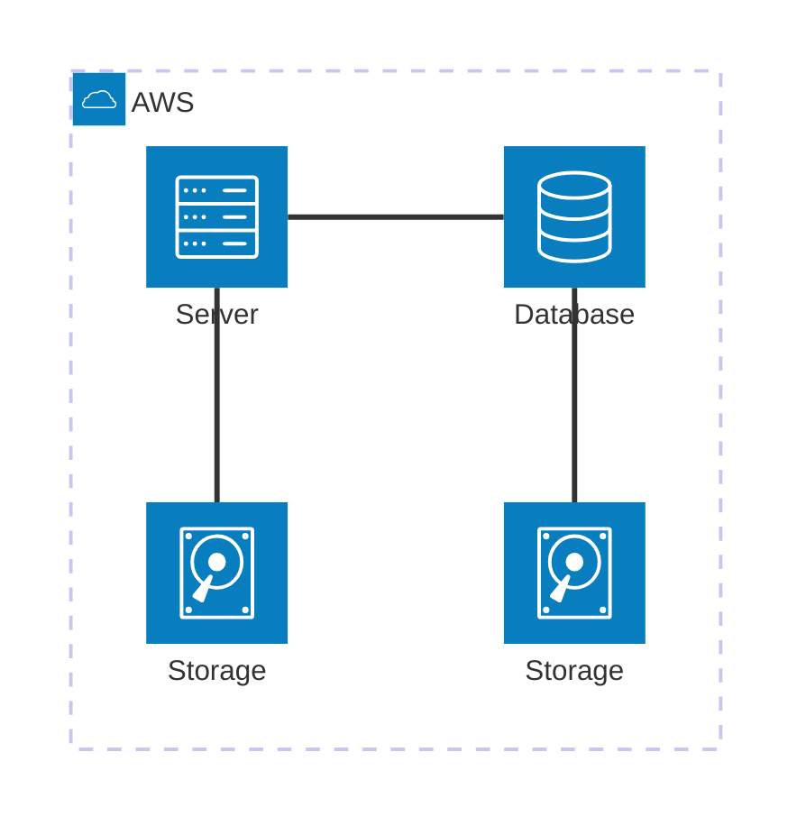

# Architecture

This page presents a simple architecture diagram using Mermaid to illustrate a basic web application flow.

- **Client (Browser)**: End user accessing the app.
- **Web Server/CDN**: Serves static assets and forwards API requests.
- **Backend API**: Application logic and integrations.
- **Database**: Persistent storage for application data.
- **Cache**: Speeds up reads of frequently accessed data.
- **External Service**: Third-party APIs your app depends on.

